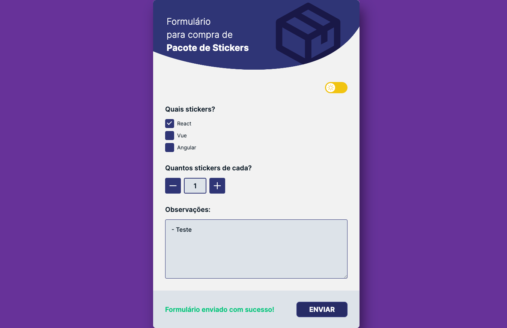

<p align="center">
   
</p>

<p align="center">   <a href="https://www.linkedin.com/in/leonne-sousa-brito/">
      
   </a>
  
  
  
  
  <a href="mailto:britoleonne@gmail.com">
   
  </a>
</p>

<p align="center">
  Aplicação desenvolvida para o desafio de Frontend da Vagas.com.br
</p>

<div align="center">
  <sub> Made with 💖 by
    <a href="https://github.com/LeonneBrito">Leonne Brito.
  </sub>
</div>

# 📌 Conteúdo

- [Imagens](#camera-screenshot)
- [Tecnologias](#rocket-technologies)
- [Como testar](#computer-how-to-run)
- [Bugs](#bug-issues)
- [Contribuições](#sparkles-issues)
- [Licença](#page_facing_up-license)

# :camera: Imagens

<div align="center">
   
   
   
   
   
   
</div>

# :rocket: Tecnologias

Esse projeto foi construido com as seguintes tecnologias:

- [Typescript](https://www.typescriptlang.org/)
- [React](https://reactjs.org/)
- [SASS](https://sass-lang.com/)
- [Vite](https://vitejs.dev/)
- [SWC](https://swc.rs/)
- [Cypress](https://www.cypress.io/)

# :computer: Como testar

```bash
# Clone o repositório
$ git clone https://github.com/LeonneBrito/desafio.vagas.git
```

```bash
# Instale as dependências
$ yarn

# Rode a aplicação
$ yarn dev
```

Vá para http://localhost:5173/ para ver o resultado.

# :bug: Bugs

Crie um <a href="https://github.com/LeonneBrito/desafio.vagas/issues">novo reporte de bug</a>, será uma honra poder ajudá-lo a resolver e melhorar ainda mais nosso aplicativo.

# :sparkles: Contribuições

- Fork esse repositório;
- Crie uma nova branch com sua feature: `git checkout -b my-feature`;
- Commit suas mudanças: `git commit -m 'feat: My new feature'`;
- Push para sua Branch: `git push origin my-feature`.

# :page_facing_up: Licença

This project is under the [MIT license](./LICENSE).
Made with 💖 by [Leonne Brito](https://www.linkedin.com/in/leonne-sousa-brito/).

Obrigado! 🌠
